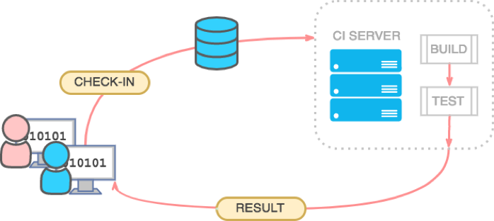
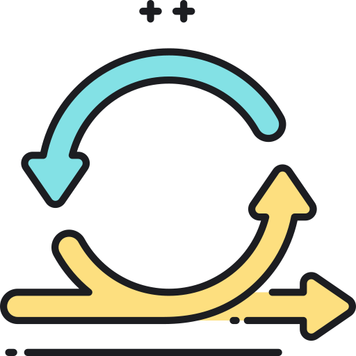

# Continuous Integration

Integracion Continua \(CI por sus siglas en ingles\) es uno de los pilares para [Devops](../devops/devops/).

CI consiste en que por cada cambio que su equipo de desarrollo **integre** al sistema de control de versiones, el servidor CI compile, construya, realice pruebas automatizadas en ambientes repetibles y automatizados y devuelva un resultado significativo a su equipo de desarrollo.

## Why CI?

