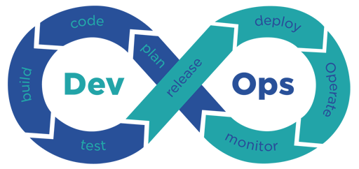

# Devops

## Introducción

Devops es un término que hoy en día se ha mal utilizado o por una falta de experiencia se cree qué se está implementando de una manera inadecuada. Definitivamente todos queremos los beneficios que este mismo provee, pero no sabemos por dónde comenzar, no sabemos en qué punto de madurez nos encontramos, no sabemos cual es el siguiente paso, etc.

Seguramente hemos visto la imagen que aparece en el encabezado de esta sección, pero realmente el proceso de Devops va mucho más allá que cumplir con un listado de elementos, es un cambio cultural, es una colaboración multidisciplinaria y un set de buenas prácticas y recomendaciones.

##  CI/CD & Devops


Devops no es solamente aplicar este pipeline a nuestro trabajo actual


