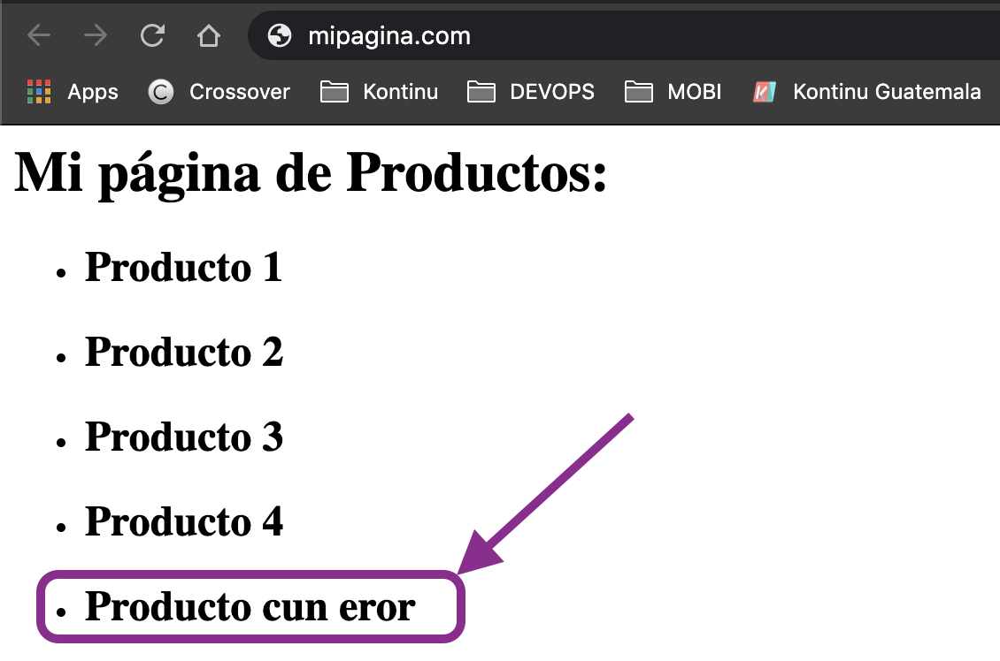

# Devops - Hypothetic Case

💡**Supongamos el siguiente caso hipotetico:**

Usted es encargado de una pagina web donde se venden algunos productos, millones de usuarios lo visitan al dia. 


Reportan que en la pagina de inicio hay un error de escritura \(como el de la imagen de abajo\)





**¿ Cuánto tiempo le tomaria a su equipo, con los procesos actuales, arreglar este error ?**

\*\*\*\*

## **Code**

Este es el código fuente de su página web.  ****

```text
#index.html
<h1>
Mi página de Productos:
</h1>

<ul>
<li> <h2> Producto 1 </h2></li>
<li> <h2> Producto 2 </h2></li>
<li> <h2> Producto 3 </h2></li>
<li> <h2> Producto 4 </h2></li>
 
<li> <h2> Producto cun eror </h2></li>
</ul>
```

\*\*\*\*

