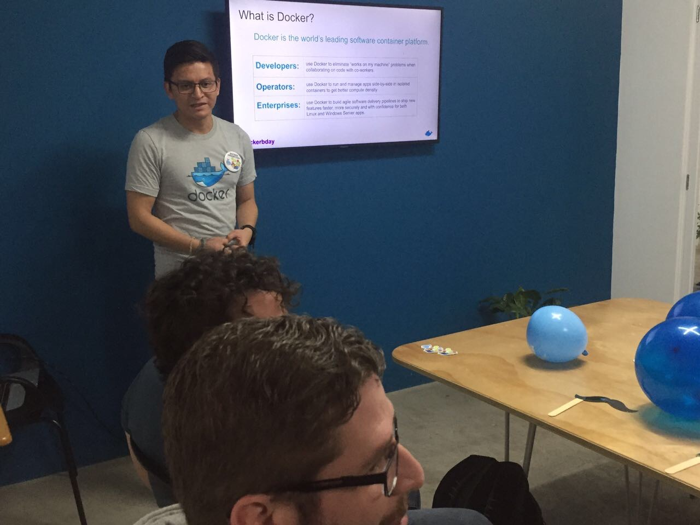

# About

* Lider de la comunidad Docker Guatemala  🇬🇹
* Actualmente Senior Devops en [mobi](https://www.mobicorp.com/company) una empresa de [geotab](https://www.geotab.com/)
* Primer programa a los 12 â. 
* Sys admin desde 2011 
* Release engineering manager 
* Platform Engineer
* Scrum Master
* He contribuido felizmente en algunos projectos open source.
* Amo cafe.
* Sys admin que le encanta programar `</>`
* DCA \(Docker Certified Associate\)
* Arquitecto Cloud
* AWS experienced user
* GCP experienced user

<table>
  <thead>
    <tr>
      <th style="text-align:center"><a href="https://www.linkedin.com/in/marcos-cano-804a1787/">Linkedin</a>
      </th>
      <th style="text-align:center"><a href="https://github.com/jmarcos-cano">Github</a>
      </th>
      <th style="text-align:center"><a href="https://twitter.com/Marcos_Kno">Twitter</a>
      </th>
    </tr>
  </thead>
  <tbody>
    <tr>
      <td style="text-align:center">
        

        

          
        

      </td>
      <td style="text-align:center">
        

        

          
        

      </td>
      <td style="text-align:center">
        

        

          
        

      </td>
    </tr>
  </tbody>
</table>