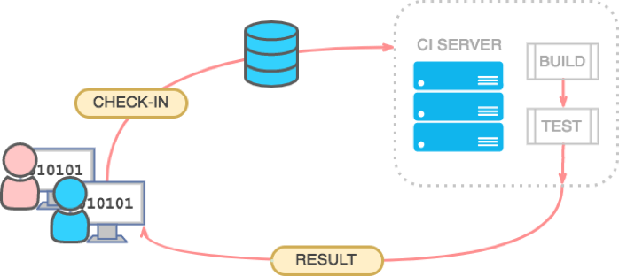

# About

* Lider de la comunidad Docker Guatemala.
* First functional program at 12 yo. 
* Started as a sys admin back in 2011 
* Release engineering manager 
* Platform Engineer
* Scrum Master
* Sys admin who loves coding &lt;/&gt;
* Lucky to contribute in some open source projects.
* Love/Need coffee.
* DCA \(Docker Certified Associate\)

<table>
  <thead>
    <tr>
      <th style="text-align:center"></th>
      <th style="text-align:center"></th>
      <th style="text-align:center"></th>
    </tr>
  </thead>
  <tbody>
    <tr>
      <td style="text-align:center">
        

        

          
        

      </td>
      <td style="text-align:center">
        

        

          
        

      </td>
      <td style="text-align:center">
        

        

          
        

      </td>
    </tr>
  </tbody>
</table>